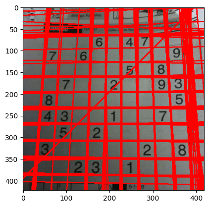
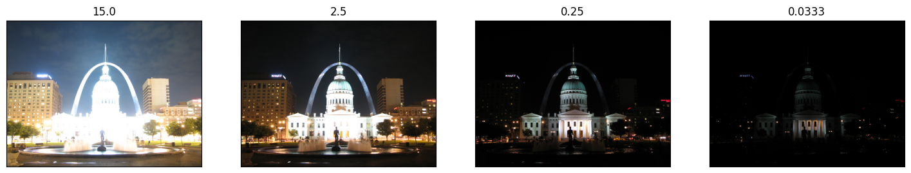
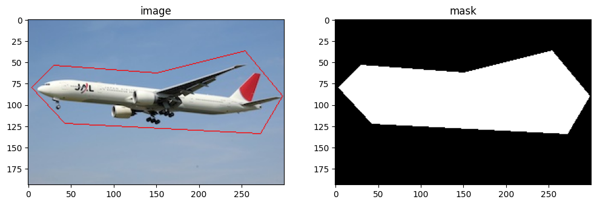

# Advanced Image Processing and Computational Photography

This project explores a range of fundamental and advanced techniques in image processing and computational photography. The primary goal is to implement and visualize various algorithms to demonstrate a practical understanding of their mechanics and applications, rather than focusing solely on achieving the highest evaluation metrics. The notebook serves as a demonstration of skills in implementing and explaining these methods.

-----

### Solution Approach

The notebook is structured as a series of demonstrations for different image processing tasks:

  * **Hough Transform for Line Detection**: Implemented both the standard (`cv2.HoughLines`) and Probabilistic (`cv2.HoughLinesP`) Hough Transform to detect lines in images. This is demonstrated on a Sudoku puzzle grid and highway lanes.
  * **Hough Circle Transform**: Utilized `cv2.HoughCircles` to detect circular objects, showcased by identifying Smarties candies and coins in sample images.
  * **Image Blending with Laplacian Pyramids**: Created a seamless blend of two different images (an apple and an orange) by using Laplacian pyramids to combine them smoothly across different frequency bands.
  * **Image Inpainting**: Implemented object removal and reconstruction on a sample image with a blemish. Both the Fast Marching Method (Telea) and Navier-Stokes (NS) based methods are used to showcase different inpainting techniques.
  * **Frequency Domain Filtering with Fourier Transform**: The notebook explores the use of Fast Fourier Transform (FFT) to move an image into the frequency domain. High-pass and low-pass filters are applied to demonstrate how to manipulate an image's frequency components to achieve effects like sharpening and blurring.
  * **Template Matching**: A classic technique to find a small patch or template within a larger image. This is demonstrated by locating a specific face in a group photograph.

-----

### Technologies & Libraries

  * **OpenCV (`cv2`)**: The core library used for all image processing and computer vision tasks.
  * **NumPy**: Used for numerical operations and handling image data as arrays.
  * **Matplotlib**: Used for displaying images and results within the notebook.

-----

### Description about Dataset

The project uses a variety of local sample images to test and demonstrate each algorithm. The images include:

  * `sudoku.jpg` and `highway-lanes.jpg` for line detection.
  * `smarties.png` and `coins.png` for circle detection.
  * `apple.png` and `orange.png` for image blending.
  * `blemish.png` for inpainting.
  * `lena.jpg` for Fourier transform analysis.
  * `messi.jpg` and a face template for template matching.

-----

### Installation & Execution Guide

1.  **Clone the repository:**
    ```bash
    git clone <repository-url>
    cd <repository-name>
    ```
2.  **Install the required libraries:**
    ```bash
    pip install opencv-python numpy matplotlib
    ```
3.  **Run the Jupyter Notebook:**
    ```bash
    jupyter notebook "Advanced Image Processing and Computational Photography.ipynb"
    ```
    Execute the cells sequentially to see the implementation and output for each technique.

-----

### Key Results / Sample Out

The notebook successfully demonstrates the visual results of each technique:

  * Lines are correctly identified and drawn over the Sudoku grid and highway lanes.
  * Circles corresponding to candies and coins are accurately detected and highlighted.
  * A blended "orapple" image is produced with a seamless transition.
  * The blemish is successfully removed from the face image using inpainting.
  * Frequency domain filtering effectively demonstrates sharpening (high-pass) and blurring (low-pass) effects.
  * The template face is correctly located within the larger group photo.

-----

### Additional Learnings / Reflections

This project served as a practical exercise in applying key computer vision algorithms. It reinforces the importance of parameter tuning for methods like the Hough Transform and template matching to achieve optimal results. Exploring techniques like Laplacian blending and Fourier analysis provided deeper insights into how images can be manipulated at a frequency level. The inclusion of different inpainting methods also highlights that various algorithmic approaches can be used to solve the same problem, each with its own trade-offs.

> 💡 *Some interactive outputs (e.g., plots, widgets) may not display correctly on GitHub. If so, please view this notebook via [nbviewer.org](https://nbviewer.org) for full rendering.*
> 









-----

## 🙏 Acknowledgments

This project represents my initial steps into the practical application of computer vision. The foundational knowledge and guidance for this work were derived from the outstanding OpenCV course taught by **Alireza Akhavanpour** on the **Maktabkhooneh** platform. His ability to deconstruct complex topics into clear, actionable steps was instrumental in the successful implementation of this project.

-----
### 👤 Author

  * **Mehran Asgari**
  * **Email:** [imehranasgari@gmail.com](mailto:imehranasgari@gmail.com)
  * **GitHub:** [https://github.com/imehranasgari](https://github.com/imehranasgari)

-----

### 📄 License

This project is licensed under the Apache 2.0 License – see the `LICENSE` file for details.

-----
# OpenCV-Image-Processing-Techniques
